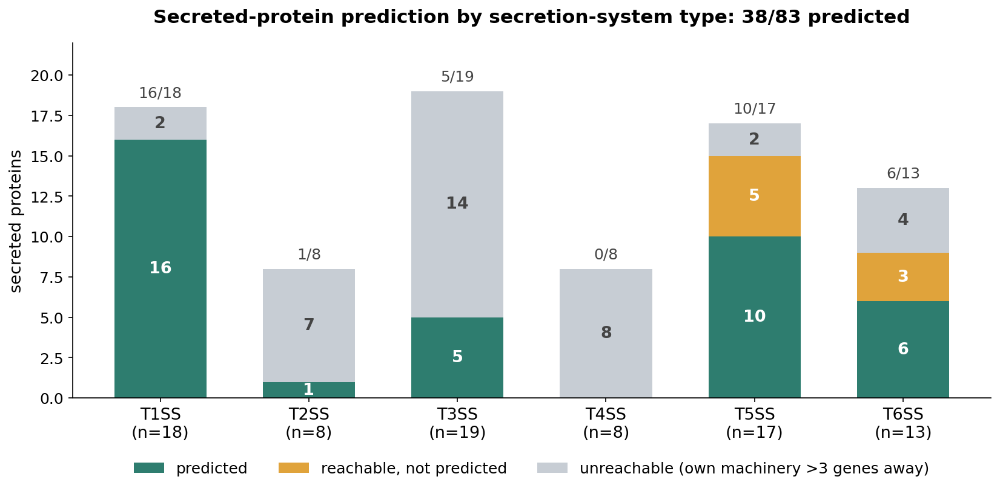
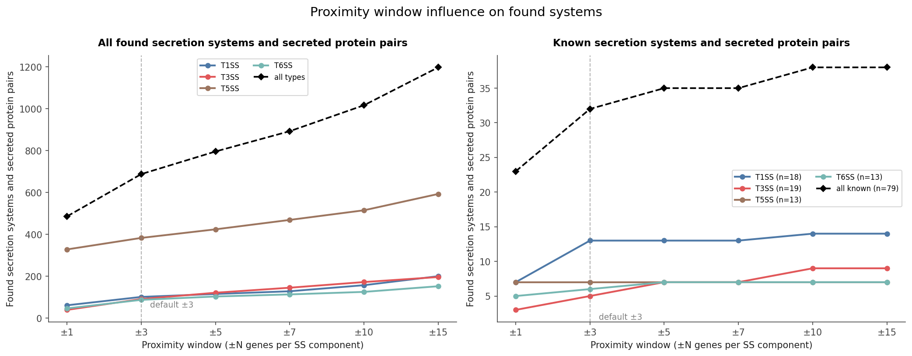

# Benchmarking ssign

Does ssign find real secretion systems and secreted protein pairs? How do variables such as input genome quality or proximity window change the results? This page reports the
**secreted-protein prediction benchmark**. A test run on real genomes to find out how many
experimentally-validated secretion-system and secreted proteins ssign actually finds.

By design, ssign only calls a substrate if a
secreted-looking protein sits within a few genes of detected secretion-system
machinery ([`pipeline_overview.md`](../explanation/pipeline_overview.md#phase-4-substrate-identification)).
This means a secreted protein encoded far from its own secretion system machinery is always unreachable.

## The benchmarking list

[`ssign_benchmarking_list.csv`](ssign_benchmarking_list.csv)
holds **83 experimentally-validated secreted proteins** from 52 genomes, each paired to a secretion system instance, spanning T1–T6SS.

Only system types ssign can detect are tested. TXSScan v1.1.4 models T5aSS, T5bSS and
T5cSS but not T5dSS or T5eSS, so the two proteins secreted by those subtypes (plpD, eae)
were dropped rather than scored as misses against machinery that cannot be found. Which
types are and are not detectable, and why, is in
[`txsscan_model_coverage.csv`](txsscan_model_coverage.csv).

## Actual recall

Each type splits into how many secreted proteins proximity could
reach at all (**reachable**: within ±3 genes of their own machinery) and how many
ssign actually predicts (**predicted**).

Run end-to-end on the 52 source genomes, ssign predicts **38 of the 83 secreted
proteins (45.8%)**. Proximity can reach 45 of them (own machinery within ±3); ssign
predicts **37 of those (82.2%)**, plus VirA serendipitously (38 total, 84.4%).

| SS type | in list | reachable ±3 | predicted |
|---|---:|---:|---:|
| T1SS | 18 | 16 (89%) | 16 (89%) |
| T2SS | 8 | 1 (13%) | 1 (13%) |
| T3SS | 19 | 4 (21%) | 5 (26%)* |
| T4SS | 8 | 0 (0%) | 0 (0%) |
| T5SS | 17 | 15 (88%) | 10 (59%) |
| T6SS | 13 | 9 (69%) | 6 (46%) |
| **Total** | **83** | **45 (54%)** | **38 (46%)** |

*T3SS predicted (5) exceeds reachable (4) by one: VirA (Shigella) is predicted
through a neighbouring T5aSS autotransporter's window (icsA, one gene away), not
its own T3SS machinery (~24 genes away). It is the only cross-system case in the
list. This is a strange case of serendipity.

A listed protein counts as predicted if its CDS span overlaps a secreted protein
ssign emitted. Because Bakta renames every locus on re-annotation, the listed
proteins are bridged to the run by genome coordinates, not locus tags.



## Robustness

### Assembly fragmentation

Draft assemblies split a genome into contigs, which can separate a secreted protein
from its machinery. Each of the 52 genomes was shattered into 1, 5, 20, 50, 100, 250,
and 500 contigs (uniform-random breakpoints, median contig N50 falling from 3.6 Mb to
13 kb) and re-run; recovery is the fraction of the complete-genome pairs still found.
At 50 contigs (120 kb N50) 95% of all found pairs and 88% of the known pairs are still
recovered; at 500 contigs (13 kb N50, a poor short-read draft) 68% and 55% remain.
Each fragmentation level is an independent random
shatter and thus
carries sampling variance that can cause a rise between levels.


### Proximity window

The ±3 proximity window was widened to ±1–±15 genes.
Past ±3 the pool keeps growing while few further known pairs are gained. 
This suggests that perhaps ±3 is the optimal window to capture real pairs while minimizing the overall pool of possible candidates that may contain false positives. 



## Scope

This test shows that ssign is indeed effective at identifying secretion systems and the proteins they secrete for the majority of those that are in the proximity window. It also shows that it cannot identify all types of systems well, especially T2SS and T4SS are out of scope for this tool, due to how far away the proteins they secrete sit from the system machinery.

The default proximity window of ±3 appears to be the optimal window for maximizing the number of found systems and secreted protein pairs while minimizing the overall candidate pool and thus potential false positives. This test also shows that ssign is relatively robust for lower quality genomes, staying moderately productive until at least 50 contigs.

Some of the systems and secreted proteins tested here were used to train the tools ssign
employs, so read the recall figures above as an upper bound. How much, and what it does
and does not affect, is measured in
[`training_data_overlap.md`](training_data_overlap.md).

## Reproduce

The benchmarking list is [`docs/benchmark/ssign_benchmarking_list.csv`](ssign_benchmarking_list.csv).
The recall matcher tests each listed protein's coordinates against the run's emitted
secreted proteins (`emitted_overlap`), with three verified RefSeq↔INSDC contig
aliases reconciled first so all 83 rows resolve. The recall table and figure are
`reachable_within_3` and `found_by_ssign` tallied by `ss_type` over that same list.

```bash
python scripts/recall_figure.py             # redraws the figure above from the list
python scripts/txsscan_model_coverage.py --diagnose   # which types TXSScan can detect
```
