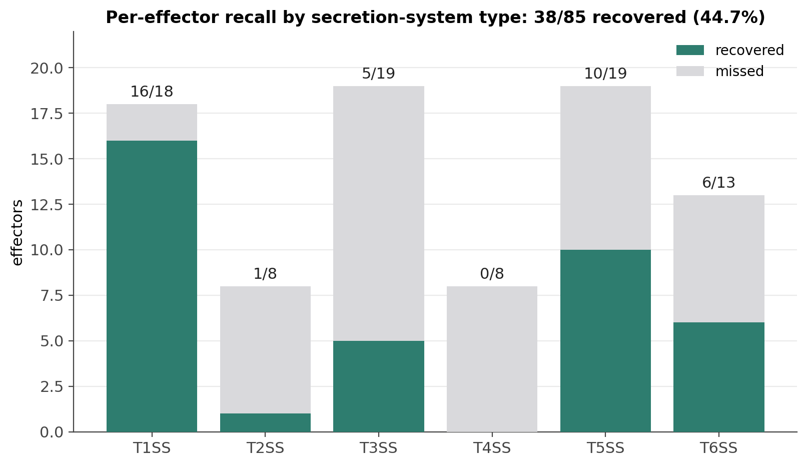

# Benchmarking ssign: effector recovery

Does ssign find real secretion systems and secreted protein pairs? This page reports the
**effector-recovery benchmark**. A test run on real genomes to find out how many
experimentally-validated secretion-system and secreted proteins ssign actually finds.

The answer is bounded by design. ssign only calls a substrate if a
secreted-looking protein sits within a few genes of detected secretion-system
machinery ([`pipeline_overview.md`](../explanation/pipeline_overview.md#phase-4-substrate-identification)).
This means a secreted protein encoded far from its own secretion system machinery is unreachable no matter how good
the predictors are. The benchmark measures the **actual recall**: how many
validated effectors ssign emits end-to-end.

## The benchmarking list

[`ssign_benchmarking_list.csv`](ssign_benchmarking_list.csv)
holds **85 experimentally-validated effectors** one per secretion-system
instance, spanning
T1–T6SS. Every row carries a UniProt accession, the source genome + contig + CDS
coordinates, and the primary reference (DOI). This was created via mining the literature.

## What proximity can and cannot reach

Because the substrate call requires a secreted-looking protein within ±3 genes of
its system's machinery, an effector encoded far from its own apparatus cannot be
recovered, no matter how good the predictors are. How often that happens is
biology: some systems are operonic (the effector sits beside its transporter),
others scatter their effectors across the genome. The benchmarking list records
this per effector in its `reachable_within_3` column, and the split is stark:
nearly every T1SS effector falls inside the window, while only 1 of 8 T2SS and
0 of 8 T4SS effectors do. Those are hard limits proximity cannot lift.

## Actual recall

Run end-to-end on the 52 source genomes, ssign recovers **38 of the 85 validated
effectors (44.7%)**:

| SS type | recall |
|---|---|
| T1SS | 16/18 (89%) |
| T2SS | 1/8 (13%) |
| T3SS | 5/19 (26%) |
| T4SS | 0/8 (0%) |
| T5SS | 10/19 (53%) |
| T6SS | 6/13 (46%) |
| **Total** | **38/85 (44.7%)** |

An effector counts as recovered if its CDS span overlaps an emitted secreted
protein. Because Bakta renames every locus on re-annotation, effectors are
bridged to the run by genome coordinates, not locus tags.

## Reading the result

The 44.7% aggregate is honest but easy to misread; the per-type view is the real
story:

- **Where proximity applies, ssign recovers ~9 in 10.** ssign recovers T1SS at
  16/18 (89%). T1SS is operonic, the effector encoded next to its own
  transporter, so it sits inside the window. Where the biology clusters the
  effector with its machinery, ssign finds it.
- **Where effectors are scattered, low recall is expected, not a pipeline
  failure.** Almost no T2SS or T4SS effector sits within ±3 genes of its
  apparatus (1/8 and 0/8 in the list), so proximity cannot reach them. **T4SS 0/8
  is the correct consequence of cross-replicon biology**: T4SS effectors sit
  distal from the VirB apparatus, often on a different replicon entirely.
  Inflating this would mean emitting genome-wide false positives.
- **T3SS and T6SS are intermediate**, at 26% and 46%: the clustered minority is
  recovered, the dispersed majority is not.
- **T5SS 53%** comes from self-detection plus the evidence gate, not proximity
  windows. The gate is recall-neutral on the benchmark set: every real T5 substrate
  carries the DeepLocPro-or-SignalP evidence the gate requires, so it drops only
  evidence-less false-positive T5 components elsewhere.
- **The aggregate weights hard and easy systems alike.** The 85 rows spread
  fairly evenly across the six types, so the proximity-hard systems (T2/T3/T4,
  ~40% of the panel) drag the single number down; each counts as much in the
  denominator as an operonic system where proximity is the right tool.

The benchmark validates the core design trade: proximity filtering buys precision
by giving up the effectors that biology places out of window. For the systems
where that filter is the right instrument, recovery is high.

## Scope and caveats

- **Single-version panel, one exception.** Four T1SS genomes are served from an
  earlier run because their listed effector sits on a contig fragmented in the
  standard input; the full-assembly recovery is worth +3 (serralysin, apxIA,
  hlyA). T1SS is unaffected by the later pipeline changes, but a same-code rerun
  of those four would make the panel fully single-version.
- **Read per type, not the aggregate.** The 85-row list spans all six types, so
  the single 44.7% blends systems proximity suits (operonic) with systems it
  fundamentally cannot help (scattered effectors). The per-type table is the
  honest read.

## Reproduce

The benchmarking list is [`docs/benchmark/ssign_benchmarking_list.csv`](ssign_benchmarking_list.csv).
The recall matcher tests each listed effector's coordinates against the run's emitted
secreted proteins (`emitted_overlap`), with three verified RefSeq↔INSDC contig
aliases reconciled first so all 85 rows resolve. The per-type figure is
`found_by_ssign` tallied by `ss_type` over that same list.

---

*Robustness sweeps (proximity-window sensitivity, assembly fragmentation, gene
copy number) and compute-scaling numbers are being re-run on this benchmark's
52-genome panel for consistency and will be added here once complete.*
