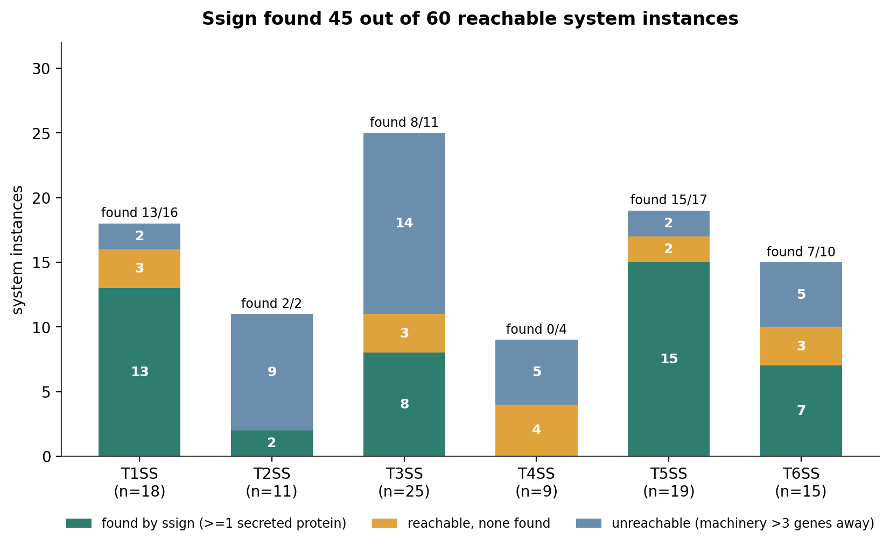

# Benchmarking ssign: effector recovery

Does ssign actually emit the proteins it should? This page reports the
**effector-recovery benchmark**: run end-to-end on real genomes, how many
experimentally-validated secretion-system effectors does ssign recover as
secreted proteins?

The answer is bounded by design. ssign only calls a substrate if a
secreted-looking protein sits within a few genes of detected secretion-system
machinery (Phase 4, [`pipeline_overview.md`](pipeline_overview.md#phase-4-substrate-identification)).
That proximity filter is what keeps false positives down, but it also means an
effector encoded far from its own apparatus is unreachable no matter how good
the predictors are. So the benchmark runs in two parts: first the **ceiling**
(what the proximity rule *could* recover if detection were perfect), then the
**actual recall** (what ssign emits end-to-end).

## The benchmarking list

[`ssign_benchmarking_list.csv`](../assets/benchmark/ssign_benchmarking_list.csv)
holds **85 experimentally-validated effectors**, one per secretion-system
instance, spanning
T1–T6SS. Every row carries a UniProt accession, the source genome + contig + CDS
coordinates, the primary reference (DOI), and a verbatim quote from that paper
showing the protein is secreted by that system type.

| SS type | effectors |
|---|---:|
| T1SS | 18 |
| T2SS | 8 |
| T3SS | 19 |
| T4SS | 8 |
| T5SS | 19 |
| T6SS | 13 |
| **Total** | **85** |

The list was built by an exhaustive blind re-read: six independent passes
re-verified every row from primary evidence, confirming that the UniProt entry is
the named effector (not a machinery or accessory paralog), that the locus is that
gene, and that the cited paper experimentally shows secretion by that system.
Four rows that turned out to be pure T3SS translocon components were dropped,
leaving the 85.

## The proximity ceiling

Before running anything, we asked: given where each effector actually sits in
gene order relative to its own machinery, what fraction *could* a "within ±N
genes of a component" rule ever reach? This uses literature-derived machinery
positions and genome annotation only, never ssign's own detector, so it is a fair
external bound.

| SS type | ceiling ±3 | ±5 | ±7 |
|---|---:|---:|---:|
| T1SS | 80% | 80% | 80% |
| T2SS | 1% | 3% | 4% |
| T3SS | 21% | 29% | 33% |
| T4SS | 6% | 8% | 10% |
| T6SS | 22% | 24% | 26% |

(Computed over a broader corpus of 499 testable effectors, so the denominators
differ from the 85-row recall panel below; the per-type *pattern* is what
carries. T5SS is absent because it self-secretes (the component is the
substrate), so there is no machinery-to-effector distance to measure.)

The rule is a strong constraint for some systems and almost useless for others:

- **T1SS ~80%.** T1SS is operonic: the effector is encoded beside its own ABC
  transporter and membrane-fusion protein. Proximity is exactly the right
  instrument here.
- **T2SS ~1–4% and T4SS ~6–10%.** These effectors are scattered genome-wide,
  thousands of genes from the apparatus. No proximity-based method can recover
  most of them; this is the clearest limit, and it is biology, not a defect.
- **T3SS ~21–33% and T6SS ~22–26%.** Intermediate: a clustered minority
  (LEE-encoded T3SS effectors, T6SS auxiliary-cluster effectors near Hcp/VgrG/PAAR)
  sits in window; the rest are dispersed.

## Actual recall

**Recall = 38 / 85 (44.7%)**, CX3 run `3169556` (2026-07-03), 52 genomes, one
multi-genome job, `extended` tier (DeepLocPro + DeepSecE + SignalP predictions;
InterProScan + EggNOG + pLM-BLAST + ProtParam annotation), Bakta re-annotation
from scratch. All 52 genomes completed every step; no tool timed out.

| SS type | recall |
|---|---|
| T1SS | 16/18 (89%) |
| T2SS | 1/8 (13%) |
| T3SS | 5/19 (26%) |
| T4SS | 0/8 (0%) |
| T5SS | 10/19 (53%) |
| T6SS | 6/13 (46%) |
| **Total** | **38/85 (44.7%)** |

An effector counts as recovered if its CDS span overlaps an emitted secreted
protein. Because Bakta renames every locus on re-annotation, effectors are
bridged to the run by genome coordinates, not locus tags.

Viewed per **system instance** rather than per effector (an instance counts as
found if ssign emits at least one of its verified effectors), ssign recovers
**45 of 60 reachable instances** (three-quarters). Each type's bar below stacks
into found, reachable-but-missed, and unreachable (own machinery more than three
genes away); the grey unreachable band is the proximity ceiling made visible.

## Reading the result

The 44.7% aggregate is honest but easy to misread. The per-type view is the real
story, and it tracks the ceiling almost exactly:

- **Where proximity applies, ssign recovers ~9 in 10.** ssign recovers T1SS at
  16/18 (89%). T1SS is operonic (the effector is encoded next to its own
  transporter), the same structure that gives T1SS by far the highest ceiling
  (~80%). Where the biology clusters the effector with its machinery, ssign finds
  it.
- **Where effectors are scattered, recall is ceiling-limited, not
  pipeline-limited.** T2SS (13%) and T4SS (0%) have ceilings of a few percent to
  ~10%. **T4SS 0/8 is the correct consequence of cross-replicon biology**: T4SS
  effectors sit distal from the VirB apparatus, often on a different replicon
  entirely. No proximity method recovers them, and inflating this would mean
  emitting genome-wide false positives.
- **T3SS and T6SS are intermediate**, at 26% and 46%: the clustered minority is
  recovered, the dispersed majority is not.
- **T5SS 53%** comes from self-detection plus the evidence gate, not proximity
  windows. The gate is recall-neutral on the benchmark set: every real T5 substrate
  carries the DeepLocPro-or-SignalP evidence the gate requires, so it drops only
  evidence-less false-positive T5 components elsewhere.
- **The aggregate weights hard and easy systems alike.** The 85 rows spread
  fairly evenly across the six types, so the proximity-hard systems (T2/T3/T4,
  ~40% of the panel) drag the single number down; each counts as much in the
  denominator as an operonic system where proximity is the right tool.

The benchmark validates the core design trade: proximity filtering buys precision
by giving up the effectors that biology places out of window. For the systems
where that filter is the right instrument, recovery is high.

## Scope and caveats

- **Protein-level headline.** The 44.7% is per effector. The per-system view
  above (45/60 reachable instances found) is the complementary read: it credits a
  system once ssign recovers any one of its effectors.
- **Single-version panel, one exception.** Four T1SS genomes are served from an
  earlier run because their listed effector sits on a contig fragmented in the
  standard input; the full-assembly recovery is worth +3 (serralysin, apxIA,
  hlyA). T1SS is unaffected by the later pipeline changes, but a same-code rerun
  of those four would make the panel fully single-version.
- **Read per type, not the aggregate.** The 85-row panel spans all six types, so
  the single 44.7% blends systems proximity suits with systems it cannot help. The
  broader 499-effector ceiling corpus is additionally T3SS-heavy, which is why the
  ceiling too is reported per type rather than as one number.

## Reproduce

The benchmarking list is [`docs/assets/benchmark/ssign_benchmarking_list.csv`](../assets/benchmark/ssign_benchmarking_list.csv).
The recall matcher tests each listed effector's coordinates against the run's emitted
secreted proteins (`emitted_overlap`), with three verified RefSeq↔INSDC contig
aliases reconciled first so all 85 rows resolve. Ceiling positions come from
literature machinery loci plus genome annotation, independent of ssign.

---

*Robustness sweeps (proximity-window sensitivity, assembly fragmentation, gene
copy number) and compute-scaling numbers are being re-run on this benchmark's
52-genome panel for consistency and will be added here once complete.*
